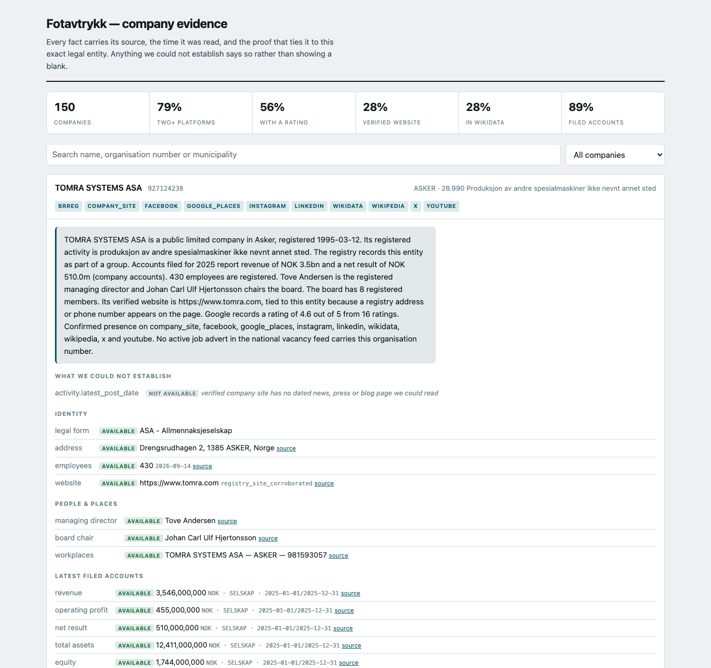
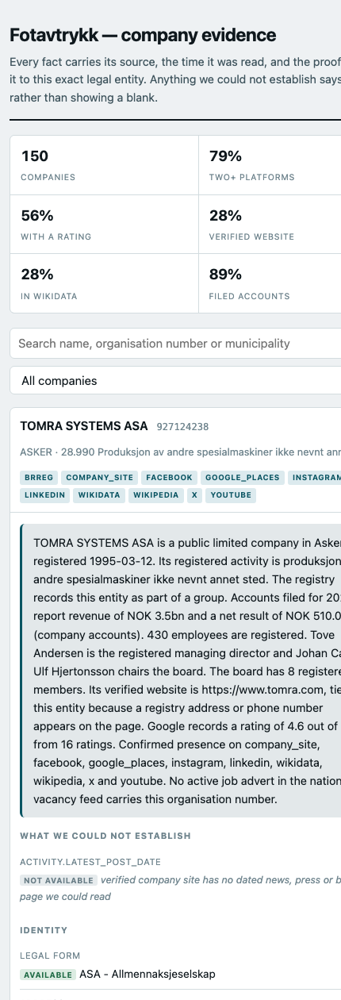

# Fotavtrykk

Registry-anchored, org-number-proven company intelligence for the
[Signalpost challenge](https://builderr.ai/challenges/signalpost).

Give it a Norwegian organisation number; it returns one terminal envelope with
claims, the evidence behind each one, and an explicit availability state for
everything it could not establish.

**The rule the whole system is built around:** nothing is published about a
company without a deterministic, re-checkable link back to its
organisasjonsnummer. When identity cannot be proven, the answer is `ambiguous`
or `not_available` — never a guess. One wrong-company publication ends
qualification, so recall is always the thing we trade away, never precision.

## Run it

```bash
uv sync
uv run fotavtrykk run \
  --organisations data/smoke-companies.jsonl \
  --output out/envelopes.jsonl \
  --report out/run-report.json \
  --snapshots out/snapshots \
  --run-id local-001 \
  --expected-count 8
```

Input is JSONL with an `organisation_number` field, or one number per line.
Output is one JSON envelope per line, in input order. The process exits non-zero
if the envelope count does not match `--expected-count`.

```bash
uv run pytest -q
```

## Status

V1 covers the official foundation and the identity gate.

| Module | Does | State |
|---|---|---|
| `orgnr.py` | MOD-11 validation, proof search, name tokens | done |
| `http.py` | Budgeted fetch, retries, snapshots, per-company counters | done |
| `registry.py` | Entity, roles, annual accounts, subunits | done |
| `site.py` | Website crawl + org-number proof gate | done |
| `batch.py` | Orchestration, terminal-envelope guarantee | done |
| `diff.py` | Reconcile, typed change events, idempotency | done |
| `snapshots.py` | Snapshot load/save, manifest, content hash | done |
| `sampling.py` | Stratified selection from the 411,160-company universe | done |
| `audit.py` | Risk-weighted audit queue, labelling, scoring | done |
| `connectors/nav_jobs.py` | NAV vacancy feed, org-number verified | done |
| `connectors/places.py` | Google Places ratings — **needs an API key** | done, unconfigured |
| `connectors/news.py` | Dated activity from verified company sites | done |
| `connectors/wikidata.py` | P2333 exact match, extra platforms, handles | done |
| `synthesis.py` | Deterministic summary, changes and unknowns | done |
| `viewer.py` | Static evidence viewer, desktop and mobile | done |
| `connectors/` | External news mentions, YouTube, sentiment | **not built** |

External connectors are where the rubric's differentiating points live. The
foundation this V1 delivers is table stakes, not a competitive position.

### Refresh

```bash
# Refresh against a prior run: changes land in each envelope's `changes` list.
uv run fotavtrykk run --organisations data/smoke-companies.jsonl \
  --output out/run2.jsonl --previous out/run1.jsonl --run-id local-002

# Diff two stored snapshots offline. Zero outbound requests.
uv run fotavtrykk refresh --previous out/run1.jsonl --current out/run2.jsonl \
  --output out/changes.jsonl --report out/refresh-report.json
```

Two independent live runs over the same companies produced **0 changes and 0
material changes** — real-world idempotency, not just a fixture replay. Diffing
a snapshot against itself reports `idempotent_rerun: true`, `false_changes: 0`,
`evidence_complete: true`.

Change detection was verified by injecting realistic movements into a live
snapshot. All seven were caught with the right type and zero false positives:

| Injected | Reported |
|---|---|
| CEO replaced | `departed_role` + `new_role` (two events, not one blob) |
| Revenue moved | `new_filing`, material |
| New subunit | `new_location`, material |
| Legal name changed | `changed_identity`, material |
| Website unreachable | `source_unavailable`, minor, **previous value preserved** |
| Currency NOK → EUR at the same number | `new_filing` + `value unchanged; currency NOK -> EUR` |

Change types are typed (`new_role`, `new_filing`, `new_location`,
`changed_description`, `became_available`, `became_unavailable`,
`source_unavailable`) rather than a flat old/new pair, because the evaluator
checks that a rerun reports *real* changes, not merely that bytes differ.

### Measured on a live 8-company batch

8/8 terminal envelopes · 38 requests (4.75/company) · 5.5s wall · p95 5,526ms ·
$0.00. Extrapolated to 100 companies: ~475 requests, roughly 24% of the 2,000
cap, comfortably inside the 45-minute wall and the 10,000ms p95 latency gate.

## The audit set

All 55 external points in the kit's scorer are multiplied by
`external_qualified`, which needs >=100 labelled observations at >=99.5%
exact-entity precision. Labels are therefore the critical path: an unlabelled
connector scores zero.

```bash
# Pick companies from the frozen universe, weighted toward those with a website.
uv run fotavtrykk select --universe data/signalpost-universe.jsonl.gz \
  --count 150 --website-fraction 0.6 --seed audit-corpus-1 \
  --output data/audit-corpus.jsonl

# Sample a risk-weighted queue and machine-label what is tautological.
uv run fotavtrykk audit queue --envelopes out/audit-corpus.jsonl --count 120 \
  --output out/audit/queue.jsonl --labels out/audit/labels.jsonl \
  --snapshots out/snapshots --review-sheet out/audit/review-sheet.txt

# Label the rest. Resumable; writes after every decision.
uv run fotavtrykk audit review --queue out/audit/queue.jsonl \
  --envelopes out/audit-corpus.jsonl --labels out/audit/labels.jsonl --reviewer <name>

uv run fotavtrykk audit score --envelopes out/audit-corpus.jsonl \
  --labels out/audit/labels.jsonl --report out/audit/report.json
```

### Labels are separated by how they were produced

An audit exists to catch the identity gate being *wrong*. Re-running the gate's
own logic over its own output cannot do that — it agrees with itself every time.
So `labelled_by` is recorded and the scorer gates on it:

| Provenance | Meaning | Counts toward qualification |
|---|---|---|
| `machine` | Primary-key lookup, re-checked against the stored payload. A Brreg record from `/enheter/{org}` returning that number involves no inference. | Yes, for `primary_key` rows only |
| `assisted` | Adjudicated from captured evidence by something other than the gate. | No — signal, not certification |
| `human` | A person read the evidence and decided. | Yes |

`qualification_passed` requires every **risky** observation to be human-labelled.
`provisional_qualification` reports what the kit's evaluator would conclude from
the labels as they stand, which is deliberately the weaker claim.

### Sampling is risk-weighted on purpose

Only **10.9%** of the 411,160-company universe has a website (measured, not
estimated — the kit's own 1,000-company sample over-represents them at 13.8%).
A representative observation sample would be ~89% registry rows and would audit
nothing falsifiable. The queue therefore over-weights company-site and handle
observations, which makes the resulting precision a **conservative lower bound**:
it is measured on a harder-than-average population.

### Proof tiers

| Tier | Evidence | Count | Published? |
|---|---|---:|---|
| `primary_key` | The source is keyed by the organisation number | 150 | yes |
| `proven_on_page` | The organisation number was the match key — on the page, in the NAV feed, or as Wikidata P2333 | 63 | yes |
| `corroborated` | Registry postcode+town or switchboard appears on the page | 21 | yes |
| `declared` | Declared by a source whose own identity is proven — a handle on a verified site, a Wikidata statement, a Wikipedia sitelink | 227 | yes |
| ~~`inferred`~~ | Name similarity only | **0** | **no — abstains** |

`declared` is the tier to watch. Identity is exact at the root, but a wrong root
takes its dependents with it, so the audit sampler weights it most heavily
(35%). Nothing publishes at `inferred` any more.

`corroborated` is independent evidence: the postcode and phone come from
Enhetsregisteret, not the page, so matching them is separate from the name.
56% of registry-declared sites corroborate.

### The inferred tier was measured and dropped

Adjudicating the 15 registry-declared sites that matched on name alone put that
tier at **84.0% exact-entity precision (8 wrong of 50 observations)** against a
99.5% floor. It was publishing group and holding sites:

- `klaveness.com` for **Klaveness Combination Carriers ASA** — the Torvald
  Klaveness *group* site, whose own navigation lists KCC as one of three
  companies under Klaveness Holding.
- `telenor.no/privat` for **Telenor ASA** — the Norwegian consumer retail portal
  operated by Telenor Norge AS, not the listed holding company's site.

Each wrong site also cascaded to the handles declared on it, so two bad sites
produced eight bad observations. A name match on a registry-declared site is now
`ambiguous`, never `available`.

Cost, measured on the same 150 companies: observations 308 → 261 (−15%),
published websites 57 → 42, `ambiguous` 18 → 34. That is the price of removing a
tier that fails the precision gate, and it is the right trade under a rubric
where one wrong-company publication ends qualification.

Two collateral fixes came out of the same review:

- Norwegian postal towns are filed with directional suffixes the page drops
  (`KRISTIANSAND S` vs `Kristiansand`), which was defeating address
  corroboration. Fixing it recovered three sites.
- Default hosting placeholders (`flyboat.no`: *"Something amazing will be
  constructed here"*) were being published as company profiles.

### Current state

150 companies → 261 observations, no `inferred` tier. 100 machine-verified
labels, `entity_precision: 1.0`, `audit_size` and `precision` passing.
`qualification_passed` remains **false** until a person adjudicates the risky
rows — 42 `proven_on_page` and 60 `corroborated` now await review, and both are
structurally stronger than the tier that was dropped.

## The submission artifact

The entry requires **at least 1,000 completed profiles plus their exact
organisation-number manifest**. Build it with budgets raised: the 2,000-request
and $10 defaults are sized for the 100-company *daily* batch and would exhaust
mid-run.

```bash
uv run fotavtrykk select --universe data/signalpost-universe.jsonl.gz \
  --count 1000 --seed submission-1 --output data/submission-1000.jsonl

uv run fotavtrykk run --organisations data/submission-1000.jsonl \
  --output artifact/profiles.jsonl --manifest artifact/manifest.json \
  --report artifact/run-report.json --expected-count 1000 \
  --request-budget 12000 --cost-limit 40 --concurrency 12
```

1,000/1,000 terminal envelopes, all `completed` · 5,320 requests · 4 minutes ·
p95 3,408ms · 1,473 observations · $35.00. The manifest's organisation list and
content hash both verify against the profile file.

### Representative, not flattering

The selection mirrors the universe — 10.5% with a website against the real
10.9%, 93% AS, 86.4% with no employee count, NACE 68 at 21.8%. That matters,
because coverage measured on the audit corpus was badly optimistic:

| family | audit corpus (60% web) | **representative (10.5% web)** | weight |
|---|---:|---:|---:|
| `two_platforms` | 79.3% | **39.3%** | 10 pts |
| `ratings_reviews` | 75.3% | **38.6%** | 8 pts |
| `buzz_engagement` | 6.7% | **0.6%** | 7 pts |
| `workforce_jobs` | 0.0% | **0.0%** | 7 pts |

The daily evaluation draws 100 companies at random from the full universe, so
**the representative column is the honest expectation**. The audit corpus is
deliberately over-weighted toward companies with a website and remains the right
population for measuring *precision* — it is the wrong one for quoting coverage.

Wikidata illustrates the gap sharply: 28% of the audit corpus but **0.8%** of a
random draw, because Wikidata holds notable companies and the universe is mostly
dormant holding companies.

## Synthesis

The rubric asks the summary to *"explain the company, changes and unknowns
without making unsupported claims"*. Two of those three are about restraint, so
the summary is generated **deterministically from published claims** rather than
by a model.

```bash
# Rebuild summaries over stored envelopes. Makes no requests and costs nothing.
uv run fotavtrykk summarise --envelopes artifact/profiles.jsonl \
  --output artifact/profiles.jsonl
```

A template cannot hallucinate a revenue figure or invent a director, it costs
nothing per batch, and it produces byte-identical output for an unchanged
snapshot — which the idempotent-refresh gate needs and a sampled model would
quietly break. Every sentence is built from a claim marked `available`, and the
evidence ids that produced it travel with the summary.

Measured over the 1,000-profile artifact: median 81 words, median 5 unknowns
listed per company, and **607 of 1,000 say plainly that no permitted external
source could be tied to the entity**. On a universe of mostly dormant holding
companies, that is the useful answer, and saying it is the point.

What the tests pin is mostly what must *not* appear: a value whose claim is
`not_available` never reaches the text, an `ambiguous` website is never
presented as verified, currency travels with every figure, group accounts are
labelled as group accounts, and a filed zero is explained rather than hidden.

## The viewer

```bash
uv run fotavtrykk viewer --envelopes out/envelopes.jsonl \
  --report out/run-report.json --output out/viewer/index.html
```

One self-contained HTML file — no framework, no build step, no network. It shows
the external footprint beside the registry facts, and for every fact it shows
**how that fact was proven** and what could not be established.



The summary leads, followed by *what we could not establish* — then the
evidence. Worth noting further down: TOMRA's Facebook, Instagram and LinkedIn
handles are each marked **confirmed by 2 sources** — found independently on the
verified company site *and* as a Wikidata P2333 statement. Two independent
routes agreeing on the same handle is corroboration, so they are merged into one
row rather than shown twice. `latest post` reads `not available` with a reason
instead of an empty cell.

Every row stacks on a phone; no element exceeds the viewport at 390px wide.



## Connectors

Both resolve to the exact legal entity before publishing. Neither will publish
on a name match — that tier was measured at 84% precision and dropped.

### NAV vacancies — working, but the ceiling is low

Uses the official [stilling-feed API](https://navikt.github.io/pam-stilling-feed/)
with the published public token (a stable private token is free on request).

The site's own `/stillinger/api/search` endpoint is **not** usable: it returns
429 after a handful of calls and stays blocked for a long window, so it cannot
carry a 100-company batch. The feed is a changelog, so it is walked **once per
batch** rather than once per company — `If-Modified-Since` jumps straight to
recent entries. Feed pages carry a business *name* only, so entries are
name-matched locally to pick candidates, then each candidate is fetched and
published only if `employer.orgnr` matches exactly.

**Measured coverage is close to zero.** Across 150 companies over a 75-day
window: 32 name candidates, 10 fetched, **0 verified**. That is not a defect —
Norway has ~13,500 active adverts against 411,160 companies in the universe, so
the absolute ceiling is ~3.3% and realistically 1–2% once large employers
posting many adverts are accounted for. The connector costs ~25 requests per
batch shared across all companies and is exact when it does fire, so it earns
its place on hit-rate, not on population coverage.

### Google Places — the biggest coverage win, and the only paid dependency

Reaches `ratings_reviews`, which nothing else available can: the registry has no
ratings and a company's own site cannot supply independent ones.

The key is read from a gitignored `.env` file, so it never reaches shell
history, the repository or a transcript:

```bash
printf 'GOOGLE_PLACES_API_KEY=your-key\n' > .env && chmod 600 .env
uv run fotavtrykk places-check --organisations data/audit-corpus.jsonl --limit 3
```

`places-check` spends about eleven cents proving the key, the identity gate and
the projected cost before committing a full batch. Without a key the connector
returns `not_available` with a reason at zero cost — never a fabricated blank.

Places matches on text, so results are candidates. A place is published only
when an **independent registry fact agrees**. Measured across 150 companies:

| proof | places |
|---|---:|
| `places_website_matches_verified_domain` | 59 |
| `places_address_matches_registry` | 36 |
| `places_phone_matches_registry` | 18 |
| **published** | **113 of 150 (75%)** |

84 of those 113 carry an actual rating; the rest are real places Google holds no
rating for, which is reported as `not_available` with a reason rather than a
zero.

**Cost, priced against the published list rather than guessed.** Text Search
**Enterprise** is $35/1,000 — $0.035 per search — and that is the tier carrying
`rating`, `userRatingCount`, `websiteUri` and phone. The field mask deliberately
omits `reviews` and `editorialSummary`, which would push the call into
Enterprise + Atmosphere at $40/1,000. Text Search has **no** monthly free
allowance (unlike Place Details), so every search bills.

That is **$3.50 per 100-company batch** against the $10 cap — and roughly **$105
across daily evaluation to 21 October**. `--places-cost-per-search` overrides the
declared price and `--cost-limit` sets the batch cap; the ledger stops the
connector before the cap rather than overrunning it.

### Dated activity — working, zero namesake risk

Targets `buzz_engagement`. Reads the company's **own** news, press or blog page
on a site that already passed the organisation-number gate, so identity is
inherited from that proof: a company writing on its own verified domain is
unambiguously that company.

Measured on 150 companies: **10 companies, 25 dated posts** — real press
releases from Vår Energi ASA, Navamedic ASA and others, each with a publication
date taken from JSON-LD or a dated DOM element. Items without a date are
dropped, never guessed.

These observations never carry a sentiment label. The source policy is explicit
that company-owned promotional copy cannot supply an independent sentiment
claim, so `activity.posts` is marked `sentiment_eligible: false`.

**Google News is not usable.** `news.google.com/robots.txt` is `Disallow: /`
with an allow-list that excludes `/rss/`, and the file names ClaudeBot and
anthropic-ai directly. Its article links are Google redirects, which would need
a second disallowed fetch to resolve. Convenient, but barred by the source
policy — the same standard that rejected the name-only identity tier.

**GDELT** was measured and shelved: free and documented, but throttled to one
request per five seconds — ~500s of a 45-minute batch for 100 companies, with
low yield for small Norwegian firms.

### Wikidata — the cheapest coverage in the system

Wikidata carries **P2333, the Norwegian organisation number**, for 10,311
entities (7,326 with a website). The organisation number is the match key, so
resolution is exact and there is no namesake risk.

It is also almost free. `haswbstatement:P2333=A|P2333=B|…` batches ~50
companies into one search and `wbgetentities` takes 50 ids at a time, so a
150-company batch cost **4 requests** and matched **42 companies (28%)**,
yielding 175 observations.

| | before | after |
|---|---:|---:|
| observations | 286 | **461** |
| `two_platforms` coverage | 28.0% | **43.3%** |
| requests | 852 | 856 |

Each entity yields a `wikidata` company profile, a `wikipedia` profile per
sitelink, and a `profile_handle` for each curated social property (P2002 X,
P2013 Facebook, P2003 Instagram, P2397 YouTube, P4264 LinkedIn) — reaching
companies that have no verified website of their own.

Access: content is CC0; `www.wikidata.org/robots.txt` restricts only named
misbehaving crawlers and the MediaWiki API is the supported programmatic
interface. `query.wikidata.org/sparql` is `Disallow: /sparql` and is **not**
used.

## How identity is decided

`site.py` publishes a domain only on one of three proofs, strongest first:

1. `org_number_labelled_on_page` — the organisation number appears next to an
   org-number label (`Org.nr`, `Organisasjonsnummer`, `MVA`). Confidence 1.0.
2. `org_number_on_page` — a MOD-11-valid matching number appears anywhere on
   the page. Confidence 0.97.
3. `registry_declared_website` — the registry declares this site *and* the
   complete legal-name token set appears in the homepage identity evidence.
   Confidence 0.80.

Anything weaker is `ambiguous`. Social handles are quarantined unless the site
itself passed the gate.

**Negative evidence overrides a name match.** If a page declares a valid
organisation number that is not ours, we abstain regardless of how well the name
reads — that is exactly how a parent, group or franchise site captures a
subsidiary. Found by building the audit: the name fallback alone would have
published such a page.

We deliberately do **not** use the "strip every non-digit from the page and
substring-match" approach. Concatenating unrelated numbers manufactures false
positives — `test_concatenated_digits_do_not_manufacture_a_match` pins this.

Verified live: `1912 NÆRING 1 AS` declares `ragde.no`, a property group's site.
The gate returns `ambiguous` rather than attributing the group's content to the
subsidiary.

## Invariants the tests enforce

- Exactly one terminal envelope per input, including on crash or exhausted budget.
- Only the six contract availability states exist; a seventh is rejected.
- Every envelope carries the same claim key set, so a field never appears or
  vanishes between runs and per-field coverage never depends on availability.
- A missing value is never a zero. A **filed** zero is published and marked
  `filed_zero: true` so an auditor can tell the two apart.
- Currency, statement type (`SELSKAP` vs `KONSERN`) and reporting period travel
  with every financial figure. Equinor files in USD; assuming NOK would be a
  fabricated value.
- Resigned officers (`avregistrert: true`) are not current leadership.
- Personal birth dates are never published.
- Observations are validated against the starter kit's own publication gate
  before emission, so a rejected observation is caught locally rather than by
  the evaluator's audit.
- Re-running the same snapshot is silent. List ordering, `0` vs `0.0`, and
  bookkeeping qualifiers are normalised away before comparison — each is a
  false-change source pinned by a test.
- A failed or blocked source preserves the last supported value **and its
  evidence**, and reports `source_unavailable`. Only a source that was read
  successfully and no longer reports a value yields `became_unavailable`.
- Observation timestamps come from the evidence, never the wall clock, so
  replaying a stored snapshot reproduces byte-identical output.

## Sources, rights and cost

| Source | Access | Licence / basis | Cost |
|---|---|---|---|
| Enhetsregisteret (entity, roles, subunits) | Official REST API | NLOD 2.0 | $0 |
| Regnskapsregisteret (annual accounts) | Official REST API | NLOD 2.0 | $0 |
| Company websites | Direct HTTPS, 10s timeout, 1 retry, ≤2MB/page, 2 concurrent per host | Permitted public page | $0 |

**TLS note.** Some Norwegian sites serve an incomplete certificate chain; a
browser recovers the missing intermediate via the AIA extension, Python does
not. Two of 56 sites in the corpus failed verification *consistently* while
serving valid content. Those are retried once without verification and the
evidence records `tls_verified: false`, so the fallback is visible to a
reviewer. A chain problem says nothing about which company owns the page, and
the organisation-number proof still has to pass. Disable with
`Fetcher(insecure_tls_fallback=False)` if a stricter posture is wanted.

No LLM or third-party paid API is used in V1. Declared third-party spend per
100-company batch: **$0.00**.

LinkedIn, Meta, Glassdoor and Indeed are never fetched. Where a verified company
site links to such a profile, the handle is recorded as declared by the company
with the company's own page as the captured evidence; the destination is not
retrieved.

### Encoding note for review

For a social handle discovered on a verified company site, `source_url` and
`content_sha256` refer to the **company page we actually captured**, while
`platform` names the destination and the handle URL rides in
`metrics.declared_url`. This keeps the hash consistent with the URL it
describes. Worth confirming with the organiser that this is the intended
encoding for declared-but-unfetched handles.

## Next

1. **Review the 90 pending observations.** This is the critical path — no
   external connector can score until the audit gate passes.
2. Google Places, NAV job feed, news — the external families that carry the
   differentiating points.
3. Static evidence viewer.
